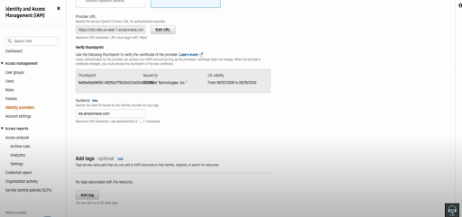

# AWS-EKS-app-deployment

### Architecture :


### Create a vpc : (_eks-vpc_)
- 2 public subnet , 2 private subnet , 1 NAT gateway , Np endpoint
  
  **Route table** : 
- 1 public rtb, and 2 private rtb
  
  **Network Connection** : 
- 1 NAT gateway
  


After creating VPC , set up iam role.

### IAM Role : 
- Role name : EKS cluster policy
 _EKS Cluster (AWS Service) -> AmazonEKSVPCResourceController (permission)_

- Role name : EKS node role
 _EC2 (AWS service)  -> AmazonEKSWorkernodePolicy , EKS_CNI_Policy , EC2ContainerRegistryReadOnly (permission)_


### EKS Cluster Configuration :
- Vpc 
- Subnets : only privates 
- Security groups 
- Cluster endpoint access : Public and Private ( Private for worker node endpoint , public for cluster endpoint )
- Addons ( coredns, kube proxy, vpc-cni by default)
- Node group : 
  _(EKS-> cluster-> Compute-> Add node Group)_
  
- Name
- Node iam role 
- AMI type : Amazon Linux 2 (AL2_x86_64)
- Capacity type : on demand 
- Instance : t2 medium 
- Node group scaling : all 1 (desired, max, min)
- Network : only private subnets 

Then check pods ( cluster -> resources -> pods)


EKS cluster configured.

### Deploying Application : 
- Aws configure with access , secret key.
- Update local kube config file 
- Create deployment.yaml (includes all yaml :  namespace, deployment, service) 
- Check pods , service .
  
  

This is deployed in private subnet . for accessing it , we need to create a load balancer through ingress.


### Load Balancing : 
1. Tagging elb role with public subnets
   
    


3. Configure  Identity Provider for Configure load balancer controller and access cluster
   
   
   
Copy connect provider url and paste it to (iam -> identity provider )



**Identity provider** : this allows us to create iam role for service-account .yaml and accessing from k8s cluster.

3. Create iam role policy for load balancer. 
- loadbalancer-controller policy.json
- loadbalancer-trust-policy.json 


**Controller policy**


**Trust policy**. Replace oidc provider id here.


Copy oidc provider id from here to trust policy. 

      
4. After creating loadbalancer controller iam role, now service.account.yaml & ingress.yaml can be deployed. 
 
**Service.account.yaml** : Configuration for setting up the AWS Load Balancer Controller in an Amazon EKS (Elastic Kubernetes Service) cluster. 
```sh
apiVersion: v1
kind: ServiceAccount
metadata:
  labels:
    app.kubernetes.io/component: controller
    app.kubernetes.io/name: aws-load-balancer-controller
  name: aws-load-balancer-controller
  namespace: kube-system
  annotations:
    eks.amazonaws.com/role-arn:
 arn:aws:iam::<accountId>:role/<loadbalancerControllerRoleName>
```

5. Install Load Balancer Controller with helm 

- Add helm repo
  
```sh
 helm repo add eks https://aws.github.io/eks-charts
```


- helm install load balancer
  
```sh
 helm install aws-load-balancer-controller eks/aws-load-balancer-controller -n           kube-system
          --set clusterName=clusterName
          --set serviceAccount.create=false
          --set serviceAccount.name=aws-load-balancer-controller
```


**AWS loadbalancer  console :** 


**Hit the load balancer DNS Url and Tada!!!**
